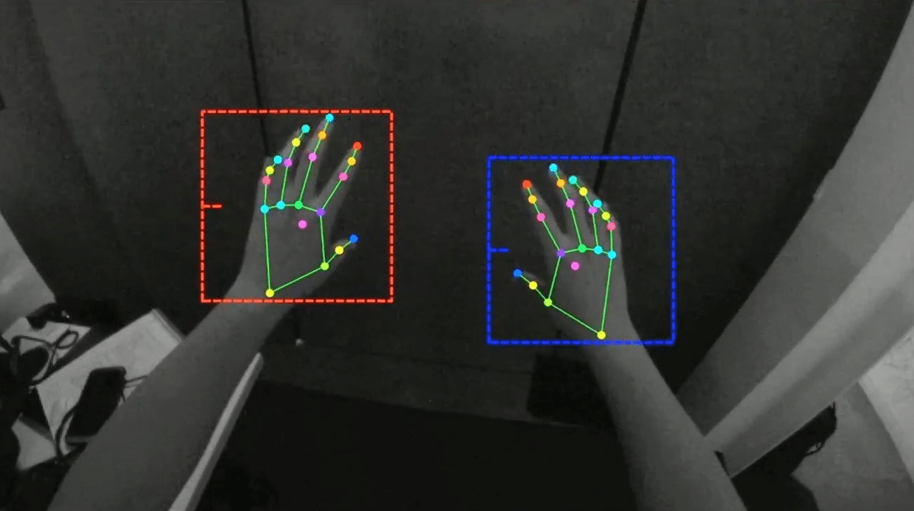

# Hand_Detection

### Introduction

This project is to detect the finger and use it to control mouse

For this project, this program only detect one hand and use some finger gesture to control mouse
If you want to know details, please click [process_document](src/process_doc)

All source codes -> [src](src)

### Developer Information

| developer | email             |
|:----------|-------------------|
| Nie Wenyu | 1695028510@qq.com |

### Program Information

|  | Mac | Linux | Windows |
|:---------------|----|-------|---------|
| Hand Detection | ✅️ |       |         | 

Reference:

https://www.markdownguide.org/ (markdownguide)

https://github.com/google/mediapipe (mediapipe)
